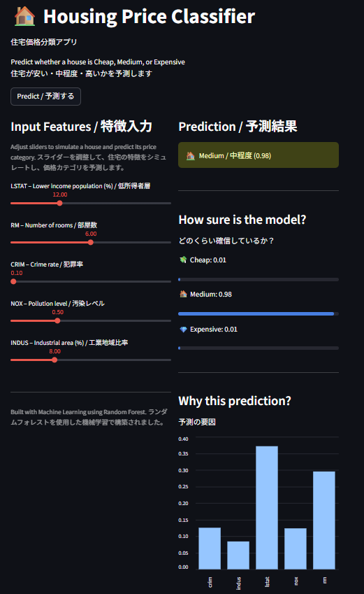

# 🏠 Housing Price Classifier  
住宅価格分類アプリ  

A machine learning web app that predicts whether a house is Cheap, Medium, or Expensive based on key features.

🔗 Live App: [[Click here](DEIN_LINK)](https://bostonhousingpriceclassifier-saschak93.streamlit.app/)

---

## 🚀 Features

- Predict housing price category (Cheap / Medium / Expensive)
- Interactive sliders for input features
- Model confidence visualization
- Explanation of key influencing factors
- Bilingual UI (English / Japanese)

---

## 🧠 Tech Stack

- Python
- Pandas
- Scikit-learn (Random Forest)
- Streamlit

---

## 📊 Model Details

- Algorithm: Random Forest Classifier
- Feature Engineering: Custom price categories
- Handling imbalance: class_weight
- Evaluation: Accuracy, Precision, Recall, F1-score

---

## 📌 Key Learnings

- Handling imbalanced datasets
- Model evaluation beyond accuracy
- Feature importance interpretation
- Deploying ML apps with Streamlit

---

## ⚠️ Disclaimer

This project is for educational purposes and uses the Boston Housing dataset.

---

## 👤 Author

Sascha
